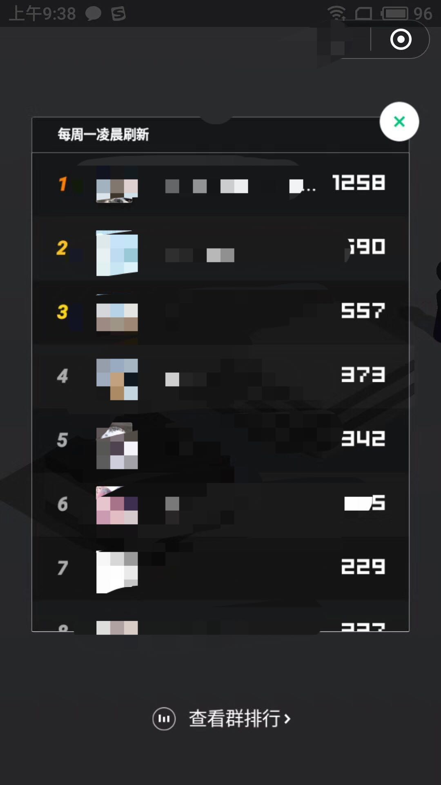

# 概述

## 环境
* 装有Python2.7.* + cv2 + adb的计算机一台
* 拥有USB调试权限的Android手机一台，不对IOS系统支持

## 运行说明
在脚本中，Android设备的分辨率是自动获取的。所有跟分辨率有关系的数值，均适用比例的方式确定，理论上可以适用不同分辨率的机型。我穷，手上只有自己的1920 * 1080的设备，其他分辨率设备没有测试过，谢谢。

唯一需要你自己手动修改的一个地方就是在主函数中，如下：

```
if __name__ == "__main__":
    obj = WeChatJumpGame()
    obj.setK(1.25)
    obj.Run()
```
第3行中的1.25是一个DuringTime/Distance 的比例值，需要自己设定，目前我设定的值是1.25，现在刷到了1250分，比起网络上其他大神来说，**不高**。

## 最后
效果图

